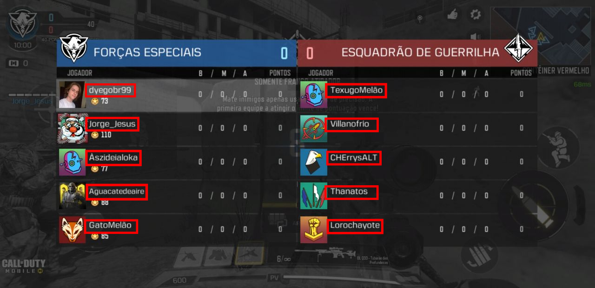

# Call of Duty Mobile's Bots Counter

This is a Telegram Bot that can recive an CODM scoreboard screenshot and then reply with how many bots are in this particular match

## How it works
Most bots on CODM matches have the same repeated names, so I created a list containing many of these names. 
#### Disclaimer
this program was written a while ago for learning pourpuses, so the **list** is probably **outdated**

So after reciving the image, the script will use ```google-cloud-vision``` to OCR and then find the players names



Then, after getting all player names in the screenshot, the script will only check if the names are on the Bots List.

## Usage
when the script is running, you can just send a screenshot and it will be checked


## Installation

clone this repository
```bash
git clone https://github.com/dyegoaurelio/codm-bots-counter.git
```

install requeriments
```bash
cd codm-bots-counter
pip install -r requirements.txt 
```

## Running
First you need to [create a telegram bot](https://core.telegram.org/bots#creating-a-new-bot)

and then [configure a Google Cloud Api project](https://cloud.google.com/vision/docs/setup).

after that you need to insert your telegram token as ```telegramToken``` variable on ```botCont.py```

then you download a json credential for your Google Cloud project and put its path as ```googleCredentialsPath``` on ```ocr.py```.

now run 
```bash
python3 botCont.py
```